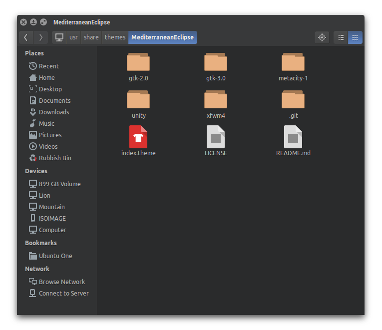
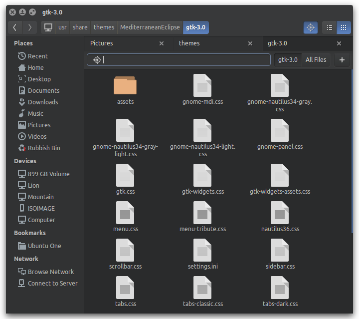

Mediterranean Eclipse GTK3 Theme
================================

GTK3 Theme for Ubuntu 14.04 based on [MediterraneanNight Series](http://gnome-look.org/content/show.php/MediterraneanNight+Series?content=156782).

This is a working in progress and it's on a very early alpha stage (very unstable).

Icon theme: [Numix Circle icon theme](https://github.com/numixproject/numix-icon-theme-circle) from [Numix Project](http://numixproject.org/)

Credits
=======

* [MediterraneanNight Series](http://gnome-look.org/content/show.php/MediterraneanNight+Series?content=156782) themes were created by [Rafa Cobreros](http://gnome-look.org/usermanager/search.php?username=trastes)

* Original Unity theme from [Moka](http://gnome-look.org/content/show.php/Moka+GTK3+Theme?content=160565) by [Sam Hewitt](http://snwh.org/) - [Moka Project](http://mokaproject.com/)
 
License
=======

[GPL - GNU General Public License](https://www.gnu.org/copyleft/gpl.html)
